# Stack Buffer Overflow 디버깅 (Stack Canary)

# 01. 문제 상황

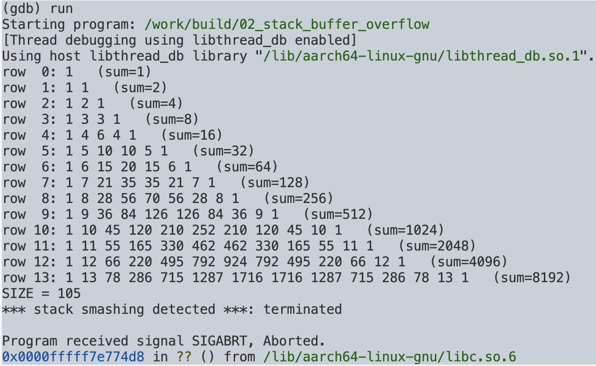

```text
*** stack smashing detected ***: terminated

Program received signal SIGABRT, Aborted.
0x0000fffff7e774d8 in ?? () from /lib/aarch64-linux-gnu/libc.so.6
```

스택에 할당된 버퍼의 범위를 넘어 데이터를 쓰면서 스택의 다른 영역까지 덮어쓴 상황이다.

프로그램이 바로 `SIGSEGV`로 종료되는 것이 아니라 `SIGABRT`가 발생했다는 점에서, 컴파일러가 삽입한 `Stack Protector`에 의해 스택 손상이 감지되었을 가능성을 확인했다.

---

## 02. `bt`

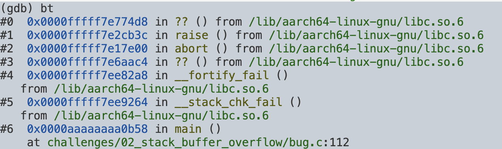

`Backtrace`를 확인해보니 다음과 같은 호출 흐름을 확인할 수 있었다.

```text
main()
  ↓
__stack_chk_fail()
  ↓
__fortify_fail()
  ↓
abort()
  ↓
raise()
  ↓
SIGABRT
```

`__stack_chk_fail()`이 호출되었다는 것은 **Stack Canary 검사에서 원래 값과 현재 값이 일치하지 않았다는 것**을 의미한다.

`GCC`의 `Stack Protector`는 함수의 스택 프레임에 Canary를 저장해 두었다가 함수가 반환하기 전에 다시 확인하고, 값이 변경되었다면 `__stack_chk_fail()`을 호출하는 방식으로 동작한다. ([GCC](https://gcc.gnu.org/onlinedocs/gccint/Stack-Smashing-Protection.html))

`main()`의 종료 시점에서 `Canary`가 변경되었고, 그 원인을 `build_pascal()`에서 찾아보기로 했다.

---

## 03. `list 105, 115`

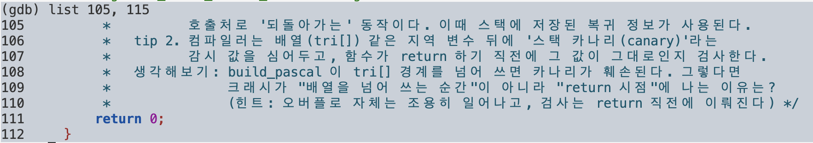

112번째 줄을 확인해보니 `main()`의 종료 부분이었다.

```c
build_pascal(tri, ROWS);
```

이후 정상적으로 실행하다가 `main()`이 종료되기 직전에 `Stack Canary` 검사가 수행되고 있었다.

개념적으로 다음과 같은 흐름이다.

```text
main() 시작
   ↓
Canary 저장

build_pascal()
   ↓
tri[] 범위를 벗어나서 씀
   ↓
Canary가 덮어써짐
   ↓
main() 종료
   ↓
원래 Canary == 현재 Canary ?
   ↓
   NO
   ↓
__stack_chk_fail()
   ↓
abort()
   ↓
SIGABRT
```

`build_pascal()`에서 실제로 `tri[]`의 범위를 넘어 쓰는지 확인하기로 했다.

---

## 04. `break build_pascal`

`build_pascal()`에 breakpoint를 걸고 반복문을 직접 따라갔다.

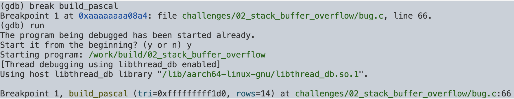
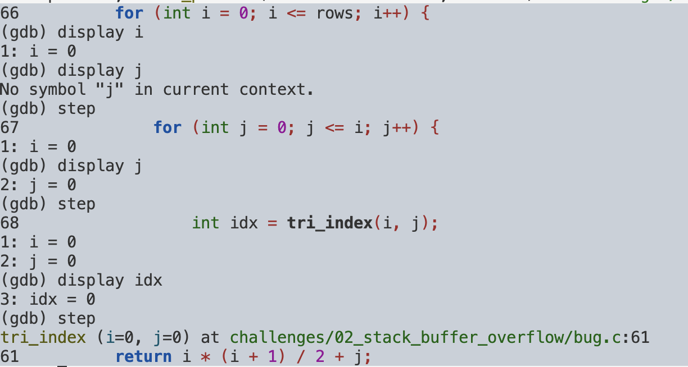

`i`, `j`, `idx`의 값을 계속 확인하기 위해 `display`를 사용했다.

```gdb
display i
display j
display idx
```

그런데 모든 반복을 `step`으로 따라가면 너무 많은 반복을 확인해야 했다. 그래서 **조건부 breakpoint**를 사용하기로 했다.

### `idx` 계산 과정 확인

```c
int idx = tri_index(i, j);
```

`tri_index()`를 통해 계산되는 인덱스는 다음과 같다.

```text
idx = i * (i + 1) / 2 + j
```

`tri`의 크기는 105이므로 유효한 인덱스 범위는 `0 ~ 104`이다. 따라서 `idx == 105`가 되는 순간부터 `tri[]`의 범위를 벗어나게 된다.

---

## 05. `break 70 if idx >= 105`

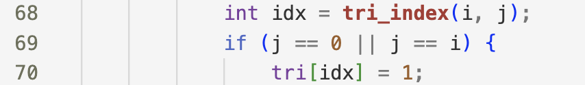

`idx`가 계산되는 부분 이후인 70번째 줄에 조건부 breakpoint를 설정했다.

```gdb
break 70 if idx >= 105
```

조건의 의미:

```text
idx < 105   → 정상 범위
idx >= 105  → 배열 범위 초과
```

`build_pascal()`의 반복 조건이

```c
for (int i = 0; i <= rows; i++)
```

이기 때문에 `rows == 14`일 경우 `i`가 14까지 증가한다. 이때 `i = 14`인 경우부터 새로운 행이 시작되면서 `idx`가 `105` 이상이 될 수 있다.

### `continue`로 반복 건너뛰기

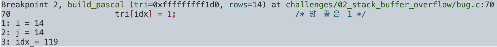

조건부 breakpoint에 걸린 이후 매번 `step`으로 하나씩 실행하지 않고 `continue`를 사용했다.

```gdb
continue
```

`continue`는 다음 `breakpoint`가 걸릴 때까지 프로그램을 계속 실행한다. 따라서 반복문을 일일이 따라가지 않고 조건을 만족하는 지점까지 이동할 수 있었다.

확인 결과 `idx`는 다음과 같이 증가했다.

```text
105 → 106 → 107 → ... → 119
```

마지막 행에서 배열의 유효 범위인 `0~104`를 넘어 `105~119`까지 접근하고 있었다.

---

## 06. 배열 범위를 초과하는 이유

`tri`의 크기는 105이므로 유효한 인덱스는 `0 ~ 104`이다.

마지막으로 유효한 인덱스가 만들어지는 경우는 `i=13, j=13`이다.

```text
idx = 13 × 14 / 2 + 13 = 91 + 13 = 104
```

따라서 `idx == 104`까지는 정상이다. 그 다음 반복 `i=14, j=0`이 되면:

```text
idx = 14 × 15 / 2 + 0 = 105
```

가 된다. 즉, **첫 번째 잘못된 인덱스는 `idx == 105`이다.**

---

## 07. 반복 조건 수정

문제의 반복문:

```c
for (int i = 0; i <= rows; i++)
```

`rows`가 행의 개수를 의미한다면 `rows == 14`일 때 필요한 행은 `0 ~ 13`이다. 따라서 마지막 행 번호까지 포함시키는 `<=`가 아니라 다음과 같이 수정해야 한다.

```c
for (int i = 0; i < rows; i++)
```

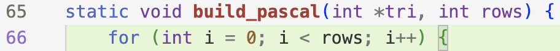

수정 후 다시 실행한 결과:

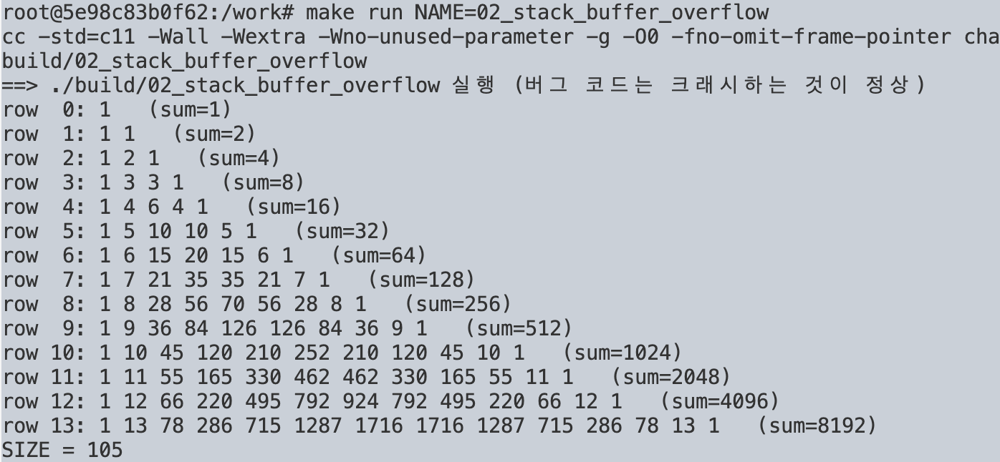

더 이상 `idx >= 105`가 발생하지 않고 프로그램이 정상적으로 종료되는 것을 확인했다.

---

# 추가 분석: 실제 Stack Canary 확인

지금까지의 디버깅으로는 `tri[]`의 범위를 벗어나는 인덱스를 발견해서 제대로 작동하는지 확인했다. 하지만 **실제로 Stack Canary가 어떤 메모리에 저장되어 있고, 배열의 잘못된 쓰기가 Canary를 어떻게 덮어쓰는지**까지는 확인하지 않았다. 따라서 수정 전 코드로 돌아가 **실제 Canary의 위치와 값**을 확인해보기로 했다.

---

## 08. `disassemble build_pascal`

```gdb
break build_pascal
run
disassemble build_pascal
```

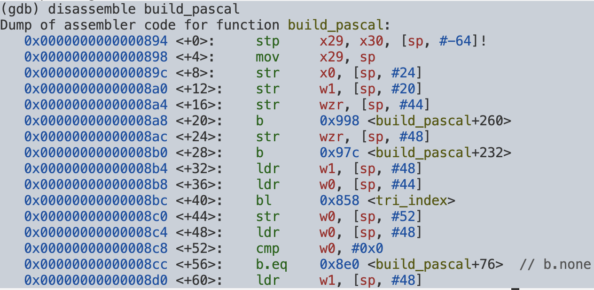
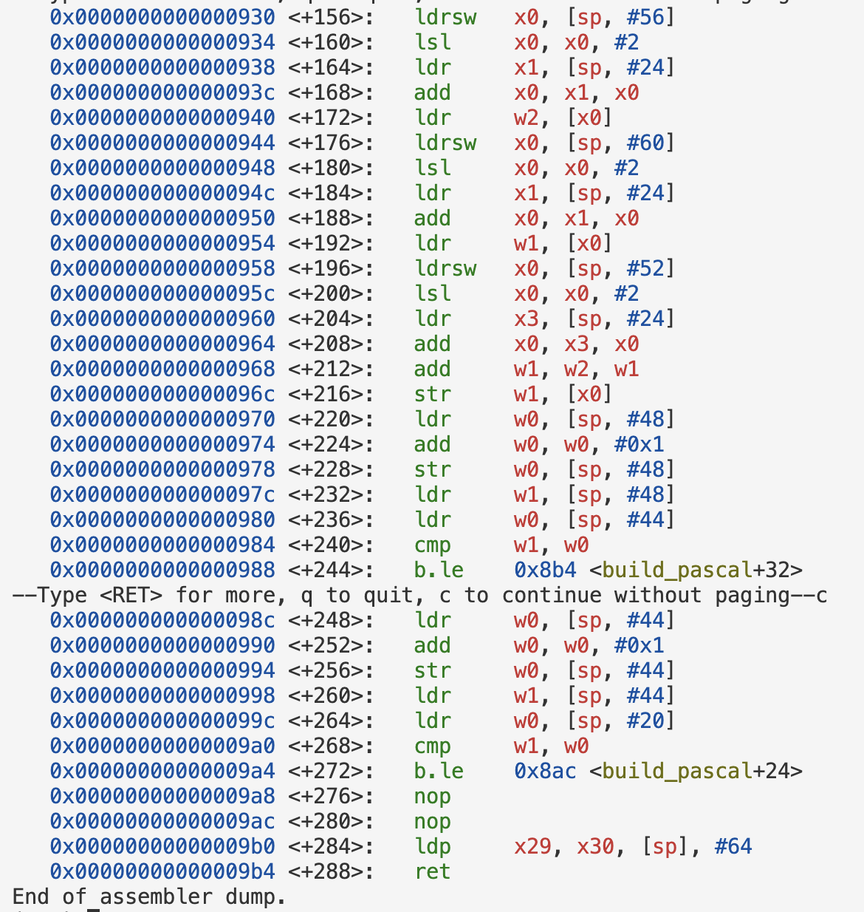

`build_pascal()`의 어셈블리를 확인했지만 `__stack_chk_fail`이나 Canary 검사 코드를 찾을 수 없었다. 함수 마지막 부분이 다음과 같이 끝난다.

```asm
ldp x29, x30, [sp], #64
ret
```

`build_pascal()` 자체에서는 Canary를 검사하지 않기 때문에, `__stack_chk_fail()`이 호출되는 `main()`의 스택 프레임을 확인하기로 했다.

---

## 09. `disassemble main` — 스택 프레임 크기 확인

```gdb
disassemble main
```
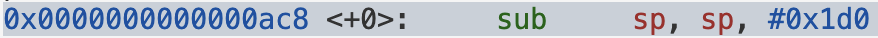
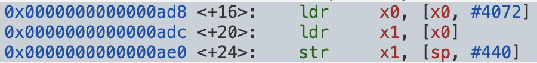
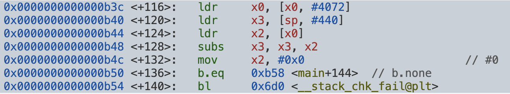


함수 시작 부분

```asm
sub sp, sp, #0x1d0
```

`0x1d0`을 10진수로 바꾸면

```text
0x1d0 = 1×16² + 13×16¹ + 0×16⁰ = 256 + 208 = 464
```

`sp = sp - 464` 명령어로 `main()`이 사용할 464바이트 크기의 스택 프레임 공간을 확보한다.

> `x86-64/AArch64` 모두 런타임 스택은 메모리의 작은 주소 방향으로 자란다. 새 지역 변수를 위한 공간을 확보하려면 스택 포인터를 더 작은 주소로 이동시켜야 하므로 값을 빼는 방식을 쓰고, 반납할 때는 더해서 증가시킨다.

---

## 10. `tri`의 시작 주소 및 각 원소 위치 계산

`main()`에서 `build_pascal()`을 호출하기 직전:

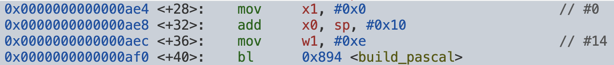

```asm
add x0, sp, #0x10
mov w1, #0xe
bl 0x894 <build_pascal>
```

`AArch64` 함수 호출 규약에서 첫 번째 인자는 `x0`, 두 번째 인자는 `x1`으로 전달되므로, 이 어셈블리는 C 코드의 `build_pascal(tri, 14);`와 매치된다.

```text
x0 = sp + 0x10 = sp + 16   → tri의 주소
x1 = 14                    → rows
```

`tri`는 `int` 배열(4바이트 단위)이므로 원소 하나당 주소가 4바이트씩 증가한다.

```text
tri[n] = sp + 16 + (n × 4)
```

```text
tri[0]   = sp + 16
tri[1]   = sp + 20
...
tri[104] = sp + 432
tri[105] = sp + 436   ← 첫 번째 OOB
tri[106] = sp + 440
```

---

## 11. Canary 값을 가져오는 과정 (ADRP / LDR)

`Canary를 가져오는 코드:`

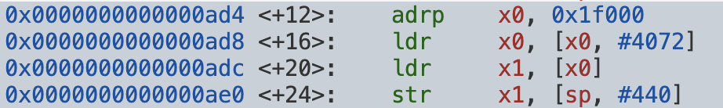

```asm
adrp x0, 0x1f000
ldr  x0, [x0, #4072]
ldr  x1, [x0]
str  x1, [sp, #440]
```

> **LDR**: Load Register — 메모리에 있는 값을 읽어서 레지스터에 넣는다.

> **STR**: Store Register — 레지스터의 값을 메모리에 저장한다.
> `[]`는 "해당 레지스터의 값을 주소로 사용해서 메모리에 접근해라"라는 뜻으로, C의 역참조와 비슷하다.
>

> **ADRP를 쓰는 이유**: 전역 변수나 라이브러리 데이터는 프로그램이 메모리에 로드될 때 실제 주소가 달라질 수 있어서, 절대 주소 대신 PC 기준 상대 주소 계산 방식(`adrp` + `ldr`/`add`)을 쓴다.

이 네 줄을 GDB로 한 명령씩(`si`) 실제로 따라가며 레지스터/메모리 값을 확인했다.

**① `adrp x0, 0x1f000` 실행 전후**

**실행전**
>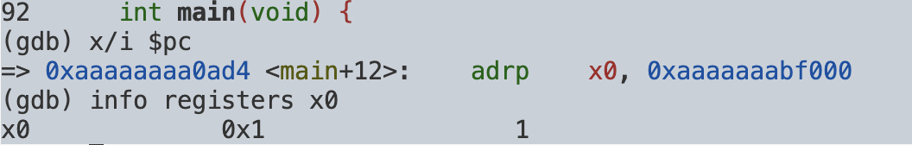


실행전엔 `x0 = 0x1`로 나온다.
이 시점의 `x0`는 아직 페이지 주소일 뿐이라 `info symbol`로도 못 찾기 때문에 다음 `ldr`에서 오프셋을 더해야 `__stack_chk_guard` 심볼 주소가 나온다.


**실행후**
>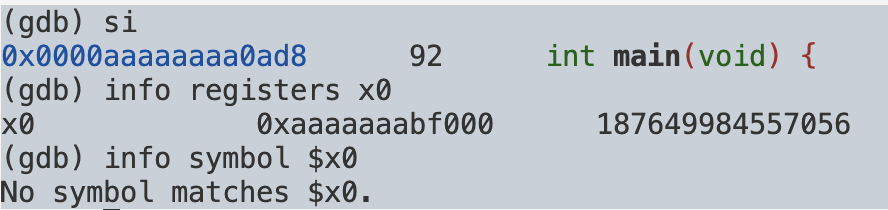
```gdb
info registers x0
x0    0xaaaaaaabf000
```

`ADRP`는 현재 `PC` 기준 `4KB` 페이지 주소를 계산해 레지스터에 넣는 명령이므로, 이 주소 자체가 `Canary` 값은 아니다.

**② 첫 번째 `ldr x0, [x0, #4072]`가 실제로 읽는 메모리**
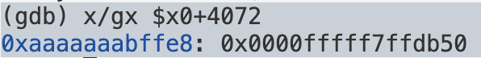

```text
LDR 목적지, [기준 주소, offset]
```

접근하는 주소:
```text
0xaaaaaaabf000 + 4072 = 0xaaaaaaabf000 + 0xfe8 = 0xaaaaaaabffe8
```

`x/gx`로 확인:
```text
0xaaaaaaabffe8: 0x0000fffff7ffdb50
```

**③ `ldr` 실행 후 `x0` 확인**
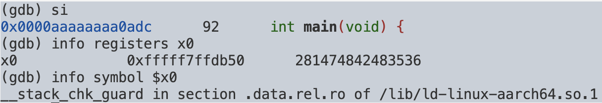

```gdb
si
info registers x0
x0    0xfffff7ffdb50
```

**④ 이 주소가 어떤 심볼인지 확인**
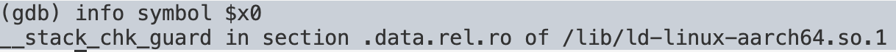

```gdb
info symbol $x0
__stack_chk_guard in section .data.rel.ro of /lib/ld-linux-aarch64.so.1
```

즉 `0xfffff7ffdb50`은 실제로 `__stack_chk_guard` 심볼의 주소였다. 여기서 중요한 점은 **`ADRP`가 처음부터 `__stack_chk_guard`의 실제 주소를 바로 넣어준 게 아니라는 것** — `ADRP`(페이지 주소 생성) → `LDR`(그 페이지 안의 값을 읽음, 이게 `__stack_chk_guard`의 주소) 두 단계를 거친다. GCC/링커가 `AArch64`에서 전역 심볼이나 `GOT`를 접근할 때 이 `ADRP`+`LDR` 조합을 사용한다.

**⑤ 두 번째 `ldr x1, [x0]`로 실제 Canary 값 확인**

`x0 = 0xfffff7ffdb50`(=`__stack_chk_guard`의 주소)이므로, 이 명령은 그 주소에 저장된 실제 값을 읽어 `x1`에 넣는다.

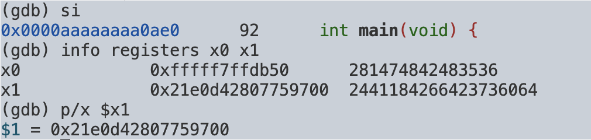

```gdb
si
info registers x0 x1
x0    0xfffff7ffdb50
x1    0x21e0d42807759700
```


`0x21e0d42807759700`이 현재 `main()`에서 쓸 원본 `Stack Canary` 값이다.

**⑥ `str x1, [sp, #440]`로 Canary를 `main()` 스택에 저장**
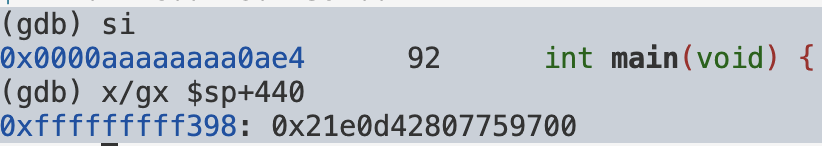

```gdb
x/gx $sp+440
0xffffffffff398: 0x21e0d42807759700
```

`__stack_chk_guard`의 원본 값과 `main()`의 `[sp+440]`에 저장된 값이 동일함을 확인했다.

### 도식화

```text
ADRP
 ↓ 전역 데이터에 접근할 수 있는 기준 주소 생성
LDR (x0+4072)
 ↓ 그 위치에 저장된 __stack_chk_guard의 주소 획득
LDR ([x0])
 ↓ 그 주소가 가리키는 실제 Canary 값 획득 (x1)
STR (x1 → [sp+440])
 ↓
main()의 [sp+440]에 원본 Canary 저장 완료
```

> `AArch64`에서 `GCC`의 `Stack Protector`는 전역 guard(`__stack_chk_guard`)를 읽어 현재 함수의 스택 프레임에 복사해두고, 함수 종료 시 다시 원본 guard와 비교하는 형태의 코드를 생성한다.

---
## 12. `tri[106]`이 Canary와 겹치는지 직접 확인하기

지금까지 두 가지를 **서로 다른 어셈블리 코드에서 각각** 알아냈다.

- (챕터 10) `add x0, sp, #0x10`에서 `tri`의 시작 주소를 역산 → `tri[n] = sp + 16 + 4n`
- (챕터 11) `str x1, [sp, #440]`에서 Canary가 저장되는 위치를 확인 → `Canary = sp + 440`

### 12-1. 수식 계산

`tri[n] = sp + 16 + (n × 4)`에 `n = 106`을 대입하면:

```text
tri[106] = sp + 16 + (106 × 4)
         = sp + 16 + 424
         = sp + 440
```

그리고 `n = 105`도 같이 계산해두면:

```text
tri[105] = sp + 16 + (105 × 4)
         = sp + 16 + 420
         = sp + 436       ← Canary(440)보다 4바이트 앞, 아직 안 겹침
```

두 결과를 나란히 놓으면 `STR`로 저장한 자리와 같다.

```text
tri[106] = sp + 440
Canary   = sp + 440  
```

**서로 다른 두 줄의 어셈블리에서 각각 독립적으로 얻은 주소(하나는 배열 인덱스 공식으로 계산, 하나는 Canary 저장 명령어에서 직접 읽음)가 정확히 같은 숫자로 떨어진다.** 이번엔 이 수식이 맞는지 `GDB`에서 직접 확인해보겠다.

### 12-2. 기준점 잡기

`build_pascal(tri, ROWS);` 호출 직전 줄에 `breakpoint`를 걸고, `tri`가 아직 스코프 안에 살아있을 때 `main()`에서 확인한다.

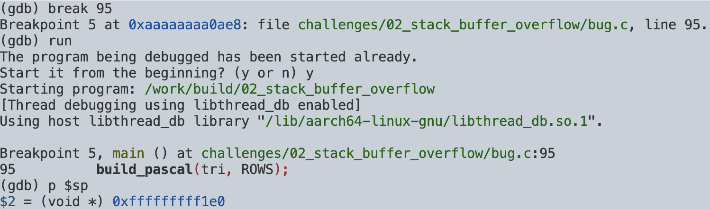

```gdb
break 95
run
p $sp
```

이 시점의 `$sp` 값을 기준으로 이후 모든 오프셋을 비교한다.

### 12-3. 소스 레벨에서 `tri[]`의 실제 주소 확인

디스어셈블 없이, `GDB`가 컴파일러의 변수 배치 정보를 이용해 직접 계산해주는 주소를 본다.

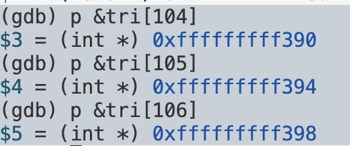

```gdb
p &tri[104]
p &tri[105]
p &tri[106]
```

세 주소가 4바이트씩 증가하는지(∵ `int` 배열) 먼저 확인했다.

### 12-4. `$sp` 기준 오프셋으로 환산

절대주소만 보면 감이 안 오니, `$sp`를 빼서 12-1에서 수식으로 계산한 값과 맞는지 비교한다.

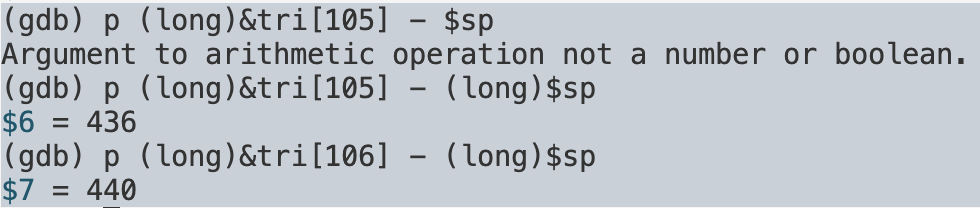

```gdb
p (long)&tri[105] - (long)$sp
p (long)&tri[106] - (long)$sp
```

> `$sp`는 `void*` 타입이라, `long`으로 캐스팅한 값과 그냥 빼면 **정수 - 포인터** 연산이 되어 에러가 난다. 
> 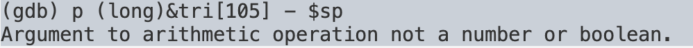`$sp`도 `(long)`으로 같이 캐스팅해야 정상적인 뺄셈이 된다.

`436`, `440`이 나왔으므로 수식값과 **정확히 일치**한다는 걸 1차로 확인했다.

### 12-5. Canary 위치와 직접 비교

챕터 11에서 어셈블리로 확인한 Canary 위치(`$sp + 440`)와, 방금 확인한 `&tri[106]`을 나란히 놓고 비교한다.

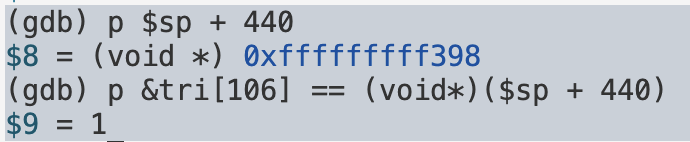

```gdb
p $sp + 440
p &tri[106] == (void*)($sp + 440)
```

`$1 = 1`(true)이 나왔으므로 **서로 다른 두 경로로 각각 알아낸 주소가 완전히 같은 지점**이라는 걸 확인할 수 있다.

따라서 실제 스택 구조는 다음과 같다.

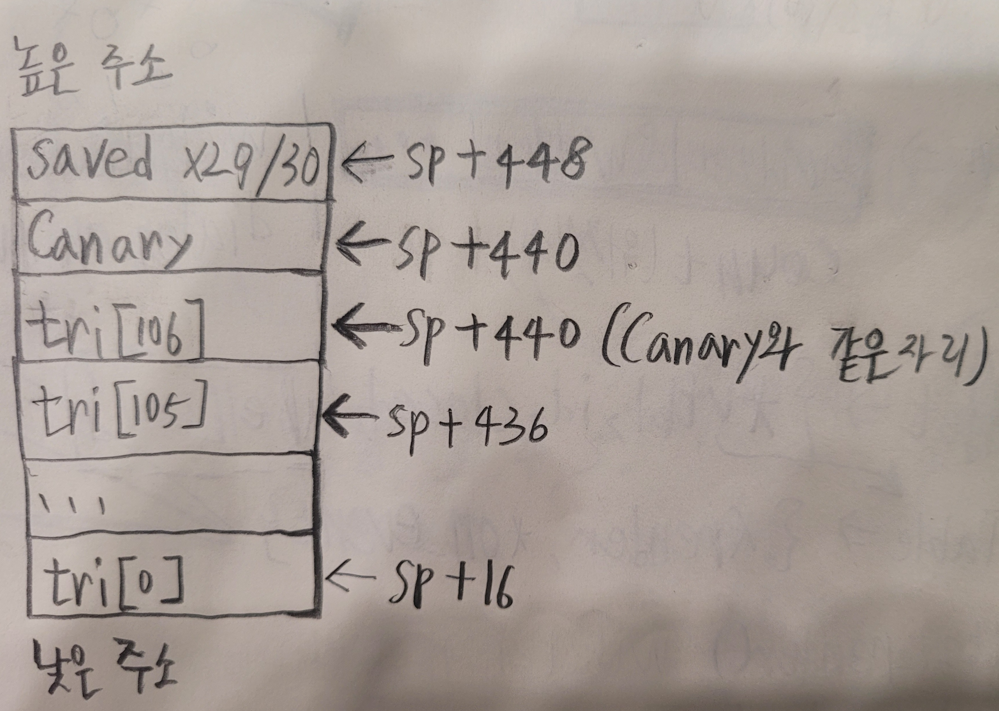

### 12-6. 그런데 왜 105가 아니고 106일까

`tri[105]`도 이미 배열 범위 밖인데, 크래시는 `tri[106]`부터 시작한다. 배열 크기가 105이므로 `tri[0] ~ tri[104]`까지만 배열 내부이고, `tri[105]`부터 이미 `C` 기준 `Out-of-Bounds`지만, 실제 바이트 범위로 보면 차이가 있다.

- `tri[105]` → `sp+436 ~ sp+439` 사용 → 배열 밖이지만 **Canary 영역(sp+440~)은 아직 안 건드림**
- `tri[106]` → `sp+440 ~ sp+443` 사용 → **정확히 Canary 시작 위치를 덮어씀**

두 주소의 `정렬(alignment)` 상태를 확인해보면 이유가 나온다.

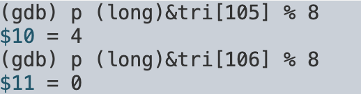
```gdb
p (long)&tri[105] % 8
p (long)&tri[106] % 8
```

`tri[105]`는 나머지 `4`(8의 배수가 아님), `tri[106]`은 나머지 `0`(8의 배수)로 나온다.

`Canary`는 `str x1, [sp, #440]`처럼 8바이트 단위로 통째로 읽고 쓰는 값이다. 그래서 컴파일러가 이 값을 8의 배수 주소에 놓으려는 것 같은데, `tri` 배열(105개 × 4바이트 = 420바이트)은 8의 배수로 딱 안 떨어진다. 그렇다면 컴파일러가 그 차이만큼 정렬용 패딩을 배열 끝에 끼워 넣었을 가능성이 있고, 공교롭게도 그 패딩 크기는 `int` 하나(4바이트)와 같다.

```text
sp+436 ~ sp+439   ← (추정) 정렬용 패딩 = tri[105]가 사용 → 영향 X
sp+440 ~ sp+447   ← 진짜 Canary 8바이트 = tri[106]이 침범 → 손상 시작
```

```text
tri[105] → OOB지만 패딩(으로 추정되는 자리)만 침범, 영향 X
tri[106] → OOB, Canary를 직접 덮어씀
```

즉 `tri[105]`는 배열 밖인데도 `Canary`는 건드리지 않고, `tri[106]`부터 문제가 생기는 이유가 정렬 때문일 가능성이 있다. 다만 이 시점에서는 아직 가설이므로, 배열 크기를 바꿔 직접 확인해보기로 했다.

### 12-6-1. 홀짝이 왜 패딩을 좌우하는지

`tri[0]`의 시작 주소는 `sp + 16`이고, `16`은 이미 8의 배수다. 즉 배열 시작점 자체가 이미 `8-byte aligned` 상태에서 출발한다.

여기서 `int` 하나(4바이트)씩 쌓일 때마다 정렬 상태가 어떻게 바뀌는지 따라가보자.

```text
tri[0]  = sp+16   → 16 % 8 = 0   정렬 O
tri[1]  = sp+20   → 20 % 8 = 4   정렬 X, 반 칸 어긋남
tri[2]  = sp+24   → 24 % 8 = 0   다시 정렬 O
tri[3]  = sp+28   → 28 % 8 = 4   또 어긋남
tri[4]  = sp+32   → 32 % 8 = 0
tri[5]  = sp+36   → 36 % 8 = 4
tri[6]  = sp+40   → 40 % 8 = 0
```

짝수 인덱스는 항상 정렬이 맞고 홀수 인덱스는 항상 4바이트 어긋난다. `int` 두 개(4바이트×2=8바이트)가 짝을 이뤄야 8의 배수가 완성되는 구조라서 그렇다.

배열이 `tri[0]`부터 `tri[SIZE-1]`까지 있다면, 그 다음 자리(`tri[SIZE]`, 첫 OOB)의 정렬은 결국 `SIZE`의 홀짝으로 갈린다.

- `SIZE`가 짝수 (`ROWS=3` → `SIZE=6`): 4바이트 조각이 짝수 개 쌓여서 딱 8의 배수로 끝남 → `tri[SIZE]`가 이미 8-aligned → 패딩 필요 없이 `Canary`가 바로 위치함
- `SIZE`가 홀수 (`ROWS=14` → `SIZE=105`): 4바이트 조각이 홀수 개 쌓여서 8의 배수보다 4바이트 모자람 (`105×4=420`, `420%8=4`) → Canary를 8-aligned에 놓으려고 4바이트가 끼워짐 → 그 자리가 `tri[105]`

```text
[짝수 SIZE=6]
┌─int0─┬─int1─┐┌─int2─┬─int3─┐┌─int4─┬─int5─┐┌───Canary(8B)───┐
   8B           8B             8B             8B 

[홀수 SIZE=105, 마지막 부분만]
...┌─int103─┬─int104─┐┌─int105─┬───???───┐┌────Canary(8B)────┐
        8B            4B        4B(빈 공간)
                     (tri[105])   (패딩)
```

`int`가 2개씩 짝을 이뤄 8바이트를 채우기 때문에, 배열 원소가 홀수 개면 마지막에 4바이트가 남는다. 이 경우 다음 8바이트 단위인 `Canary`와 맞추기 위해 4바이트의 공간이 생긴다. 짝수 개라면 맞춰서 떨어진다.

### 12-7. 가설 검증: 배열 크기 바꿔서 재현

패딩 가설이 맞다면 `SIZE`가 짝수일 땐 패딩 없이 첫 OOB부터 바로 `Canary` 자리를 건드려야 한다. `ROWS=3`(`SIZE=6`, 짝수)으로 바꿔서 직접 확인했다.

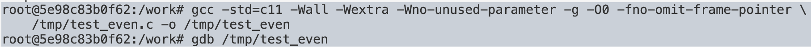

```bash
gcc -std=c11 -Wall -Wextra -Wno-unused-parameter -g -O0 -fno-omit-frame-pointer \
    test_even.c -o test_even
```

이번 빌드에서도 Canary가 `sp` 기준 어디에 저장되는지부터 확인해야 한다. `ROWS`가 바뀌면 스택 프레임 크기 자체가 달라지니 `sp+440`이 그대로 적용될 수 없다.

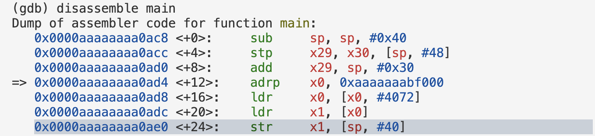

```gdb
break main
run
disassemble main
```


여기서 `str x1, [sp, #OFFSET]` 줄을 찾으면 이 빌드에서의 Canary 위치를 알 수 있다.

`str x1, [sp, #40]` — Canary는 `sp+40`에 있다.

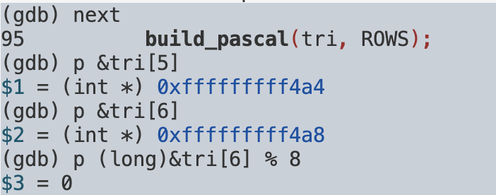
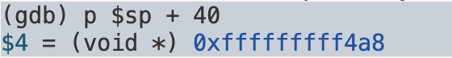
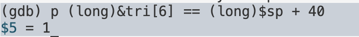

```gdb
next
p &tri[5]
p &tri[6]
p (long)&tri[6] % 8
p $sp + 40
p (long)&tri[6] == (long)$sp + 40
```

`(long)&tri[6] == (long)$sp + 40` 
결과가 참으로 나왔으므로 짝수 `SIZE`에서는 패딩 없이 
첫 OOB 인덱스(`tri[6]`)가 곧바로 이 빌드의 `Canary` 주소와 일치한다는 뜻이다. 

---

## 13. Canary 검사 로직 (`main()` 종료 부분)

11번에서는 `Canary`를 저장하는 과정을 따라갔는데, 이번엔 그 반대 — 저장해둔 값과 원본을 다시 비교하는 부분을 직접 따라가보았다.

`main`의 마지막 어셈블리 코드:


```asm
ldr x0, [x0, #4072]
ldr x3, [sp, #440]
ldr x2, [x0]
subs x3, x3, x2
b.eq ...
bl __stack_chk_fail
```

이 블록은 `ldr x0, [x0, #4072]`로 시작한다. 
11번에서 `guard` 주소를 읽어올 때 썼던 것과 같은 오프셋(`#4072`)이라, 
저장할 때 썼던 `guard` 주소를 다시 읽어와서 이번엔 원본 카나리 값과 비교할 때 쓰는 걸로 보인다. 

### 13-1. 비교 블록에 breakpoint 걸기

`disassemble main`으로 확인한 이 블록의 시작 주소를, 
절대 주소 대신 `main+116`처럼 함수 기준 `offset`으로 걸었다.

```gdb
break *main+116
run
```

### 13-2. `si`로 한 줄씩 따라가며 레지스터 확인

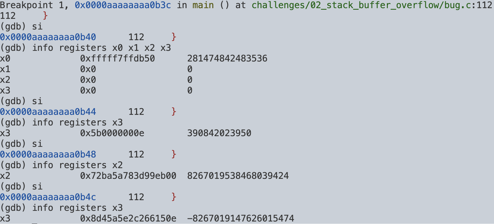

```gdb
si
info registers x0 x1 x2 x3
```

```text
x0   0xfffff7ffdb50   281474842483536
x1   0x0              0
x2   0x0              0
x3   0x0              0
```

`x0`가 11번에서 확인했던 `__stack_chk_guard`의 주소(`0xfffff7ffdb50`)와 같다. 아직 `ldr x3, [sp, #440]`은 실행 전이라 `x3`는 `0`이다.

```gdb
si
info registers x3
```

```text
x3   0x5b0000000e   390842023950
```

`ldr x3, [sp, #440]`이 실행되면서 현재 스택에 저장돼 있던 Canary 값이 `x3`로 들어왔다.

```gdb
si
info registers x2
```

```text
x2   0x72ba5a783d99eb00   8267019538468039424
```

`ldr x2, [x0]`으로 `guard` 원본 주소에서 다시 읽어온 원본 `Canary` 값이 `x2`에 들어왔다.
`x2`(원본)와 `x3`(현재 스택 값)가 다른 게 보인다.

```gdb
si
info registers x3
```

```text
x3   0x8d45a5e2c266150e   -8267019147626015474
```

`subs x3, x3, x2`가 실행되고 `x3`에 두 값의 차가 들어갔다. `0`이 아니므로 두 Canary가 서로 다르다는 게 이 시점에 수치로 확인된다.

### 13-3. 분기 결과 확인

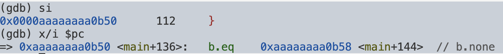

```gdb
si
x/i $pc
```

```text
=> 0xaaaaaaaa0b50 <main+136>:  b.eq  0xaaaaaaaa0b58 <main+144>  // b.none
```

`subs` 결과가 `0`이 아니었으니 `EQ` 플래그가 성립하지 않는다. 즉 `b.eq`는 실행돼도 분기하지 않고 그대로 다음 줄로 넘어간다.

```gdb
si
x/i $pc
```

한 번 더 넘겨보면 `main+144`(정상 return)가 아니라 `main+140`, 
`bl __stack_chk_fail`로 넘어가는 걸 확인할 수 있다. 
저장(11번) → 비교(13번) → 실패 분기까지, `__stack_chk_fail()`이 호출되는 순간을 
어셈블리 레벨에서 처음부터 끝까지 직접 확인했다.

---

## 14. Canary가 실제로 변경되는 순간 확인하기

`idx == 105`와 `idx == 106` 시점 각각에서 메모리를 확인해서 진짜 바뀌는 순간을 확인했다.

여기서 주의할 게 하나 있다. `idx`는 `build_pascal()` 안의 지역변수라 `breakpoint`를 `build_pascal()` 내부(70번째 줄)에 걸 수밖에 없는데, 
그러면 `$sp`가 `main()`이 아니라 `build_pascal()` 자기 자신의 스택 프레임을 가리키게 된다. 
지금까지 써온 `sp+440` 공식은 전부 `main()`의 `$sp` 기준이라 여기선 그대로 쓸 수 없다.

대신 이 breakpoint에 멈추면 인자로 넘어온 `tri` 값이 그대로 보인다. `tri`는 `main()`에서 `sp+16`으로 넘긴 주소이므로

```text
Canary = sp_main + 440 = tri + 424 (∵ 440 - 424 = 16)
```

이렇게 프레임 상관없이 `tri` 기준으로 바로 Canary 주소를 구할 수 있다.

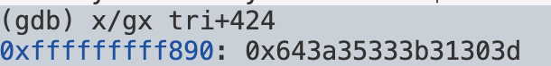
```gdb
break 70 if idx == 105
run
x/gx tri+424
```

> `tri`는 `int*` 타입이라 `tri+424`라고 쓰면 GDB가 C 포인터 연산 규칙 그대로 
`int` 424개(= 424 × 4 = 1696바이트)만큼 더해버린다. 
그래서 처음엔 전혀 엉뚱한 주소(배열 안쪽의 실제 데이터, 그래서 값도 ASCII처럼 보이는 이상한 숫자)를 찍었다.
바이트 단위로 정확히 더하려면 `char*`로 캐스팅해야 한다.


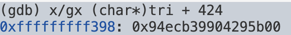
```gdb
x/gx (char*)tri + 424
```
이제 주소가 `sp_main+440`(11번에서 확인한 Canary 위치)과 정확히 일치하고, 끝자리가 `00`으로 끝나는 원본 `Canary` 패턴이 나온다. 
아직 `tri[105]`가 이 자리를 건드리기 전이라 원본 값 그대로여야 한다.


`idx == 106`은 `i=14, j=1`인 경우라 `j`가 `0`도 `i`도 아니어서 else 분기(`tri[idx] = tri[up_left] + tri[up_right];`, 74번 줄)로 들어간다. 이 줄은 `if` 판별문(69번 줄)을 지나야 나오는데, 69번은 `if`/`else` 상관없이 매 반복마다 무조건 실행되니까 여기다 걸어야 105든 106이든 다 잡힌다.

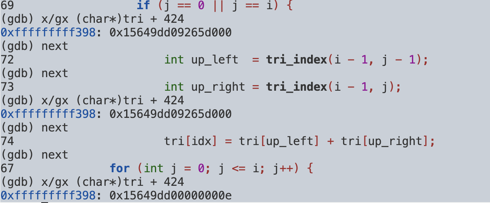
```gdb
delete
break 69 if idx == 106
run
x/gx (char*)tri + 424     # tri[106] 저장 전
next
next
next
next
x/gx (char*)tri + 424     # tri[106] 저장 후
```

`next`를 4번 해야 하는 이유는, 69번(if 판별) → 72번(`up_left` 계산) → 73번(`up_right` 계산) → 74번(실제 대입문) → 다시 67번(for 루프로 복귀)까지 
한 줄씩 넘어가기 때문이다. 
74번 줄이 실행돼야 실제로 메모리에 쓰기가 일어나므로, 그 줄을 완전히 지나야 바뀐 값을 볼 수 있다.

```text
저장 전: 0x15649dd09265d000
저장 후: 0x15649dd00000000e
```


리틀엔디안이라 이 8바이트 값의 하위 4바이트가 `tri[106]`이 차지하는 `sp+440~443`이고, 
상위 4바이트(`15649dd0`)는 Canary 나머지 절반(`sp+444~447`)이라 이번엔 안 건드려진 걸 볼 수 있다. 
하위 4바이트만 `9265d000` → `0000000e`로 바뀐다.

`0x0000000e`는 10진수로 `14`인데, 이것도 그냥 나온 숫자가 아니다. 
`tri[106] = tri[up_left] + tri[up_right]`이고 `up_left = tri_index(13,0) = 91`, `up_right = tri_index(13,1) = 92`다. 
13번 행은 `1 13 78 ...`이므로 `tri[91]=1`, `tri[92]=13`, 둘을 더하면 `14`. 즉 파스칼 삼각형 계산 로직이 정상적으로 돌아가는 와중에, 
그 계산 결과가 그대로 `Canary`의 앞쪽 절반에 들어가버린 것이다.


```text
Canary 원래 값 ((char*)tri+424 = sp_main+440)
      ↓
tri[106]에 값 저장
      ↓
Canary 값 변경됨
      ↓
main() 종료 → 원본 Canary와 비교 → 불일치 → __stack_chk_fail()
```

지금까지 이 흐름을 직접 눈으로 확인했다.

---

## 15. 결론
`<=`를 `<`로 바꾸는 게 이번 디버깅의 끝이라고 생각했는데, 실제로는 그 이후에 확인할 게 더 많았다. 단순히 범위를 넘은 문제라고 생각하고 넘어갈 수도 있었지만, 왜 특정 지점부터 문제가 생기는지 따라가면서 어셈블리와 스택 프레임, `Canary`가 배치되는 위치까지 확인하게 됐다.

특히 `tri[105]`와 `tri[106]`에서 결과가 달라지는 이유를 확인하는 과정이 기억에 남는다. 처음에는 패딩 때문이라고 생각했지만, 실제로 그런지 확인하기 위해 `ROWS`를 바꿔 짝수 `SIZE`로 다시 빌드하고 GDB에서 메모리를 직접 확인했다. 수식으로 계산한 주소와 GDB에서 확인한 주소를 비교하면서 `tri[105]`와 `tri[106]`이 각각 어디를 가리키는지 확인했다. 어셈블리도 설명만 보고 넘어가지 않고 실제로 캡처한 명령어와 비교하면서 `adrp`, `ldr`, `str`이 각각 어디에서 사용되는지 다시 확인했다.

GDB를 사용하면서는 값이 예상과 다르게 나오는 경우를 하나씩 원인부터 다시 확인했다. `tri`가 `int*`이기 때문에 `tri+424`가 424바이트가 아니라 424개의 `int`만큼 이동한다는 것, `build_pascal()` 안에서 확인하는 `$sp`는 `main()`의 `$sp`와 다른 스택 프레임을 가리킨다는 것, `idx==106`은 `else` 분기에서 처리되기 때문에 해당 분기 안에 `breakpoint`를 걸어야 한다는 것 등을 직접 확인했다.

이번 디버깅에서는 코드를 수정하는 것보다, 그 수정이 실제 메모리에서 어떤 변화를 만드는지 확인하는 데 더 많은 시간을 들였다.

---

## 16. 추가로 공부할 내용

이번 디버깅으로 배열 인덱스 오류 하나가 어셈블리 레벨까지 어떻게 이어지는지는 봤는데, 파고들다 보니 궁금한 게 더 남았다.

**① `__stack_chk_guard`는 정확히 뭘까**
`ldr x0, [x0, #4072]` / `ldr x1, [x0]`로 읽어온 게 어떤 전역 guard인지 심볼 자체는 확인했는데, 이 값이 실행마다 어떻게 정해지는지는 안 봤다. `info address __stack_chk_guard`, `p/x __stack_chk_guard`로 좀 더 파봐야 할 것 같다.

**② 왜 굳이 스택에 복사해두고 나중에 비교하는 방식인가**
`str x1, [sp, #440]`으로 원본을 복사해뒀다가 함수 끝날 때 다시 비교하는 구조인데, 그냥 전역 값을 매번 직접 비교하면 안 되는 건가 싶다. GCC가 AArch64에서 guard 위치를 다르게 잡는 경우도 있다던데 그것도 같이 봐두면 좋을 것 같다.

**③ Canary가 배열 바로 뒤에 오는 게 항상 그런건지**
이번엔 `tri → Canary → saved registers` 순서를 직접 주소로 확인했는데, 이게 이 컴파일러/이 설정에서만 그런 건지 일반적인 배치인지는 모르겠다. 컴파일러 버전이나 stack-protector 옵션이 바뀌면 배치도 달라질 수 있다니까, 다른 조건에서도 한번 찍어보고 싶다.

**④ `sp`, `x29`, `x30`은 여기서 어떤 역할이었나**
```asm
sub sp, sp, #0x1d0
stp x29, x30, [sp, #448]
add x29, sp, #0x1c0
```
`sp+448`에 있는 `saved x29`(호출자 프레임 포인터)랑 `saved x30`(복귀 주소)이 Canary(`sp+440`)보다 더 안쪽에 있다는 걸 확인했다. `tri[]`에서 시작한 오버플로우가 이 값들까지 가기 전에 Canary를 먼저 건드리게 되는 배치라, 이 순서가 우연이 아니라 `Stack Protector`가 노리는 지점이라는 걸 알게 됐다. `SP / FP / saved FP / saved LR / local variables / Canary` 관계를 다른 예제에서도 그려보면 더 감이 잡힐 것 같다.

**⑤ 실제로 덮어쓰는 순간의 `str` 명령어**
```asm
str w1, [x0]
```
`x0`가 `tri`의 특정 원소 주소, `w1`이 저장할 값인 건 확인했는데, `x0`랑 `$sp+440`을 나란히 비교하는 것까지 해보면 `tri[106]`이 왜 Canary를 덮어쓰는지 어셈블리 레벨에서 한 번 더 명확해질 것 같다.

**⑥ `subs`/`b.eq` 조합**
```asm
subs x3, x3, x2
b.eq ...
```
`x3 - x2`가 0이면 `b.eq`로 정상 return, 아니면 그대로 넘어가서 `__stack_chk_fail()`을 호출하는 걸 직접 확인했지만, x86-64에서는 이 비교 로직이 어떻게 다르게 생겼는지도 비교해보고 싶다.